# AZ305 Original Notes

### Design identity, governance, and monitoring solutions (25–30%)

### **Azure Monitor**

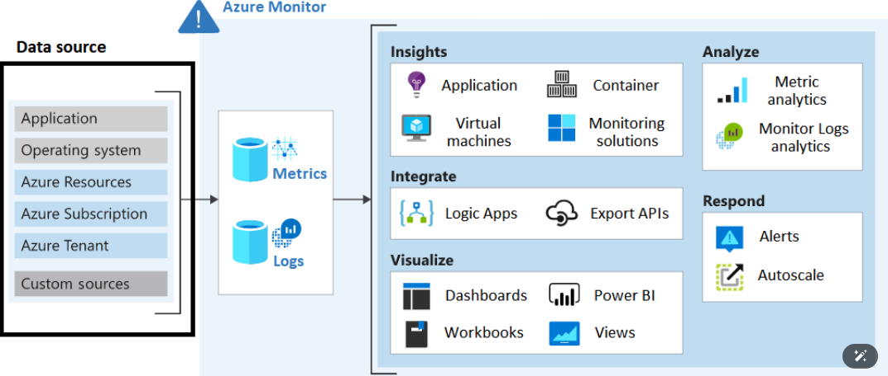

- Data types
  - Metrics: Numeric data; lightweight; collected near real time; used for alerting.
  - Logs: Text or numeric data collected intermittently, such as when events occur; used for root-cause analysis.
  - Distributed traces: Track interactions among individual components within a monitored application.
  - Changes: Record various changes to monitored resources.
- Using monitoring data with Azure Monitor
  - Alerts and automated actions: Detect abnormal metrics or logs and automatically issue alerts.
  - Visualization: Use Azure Workbooks to easily visualize monitoring data.
  - Deeper analysis: Azure Monitor Insights

    | Insight | Description |
    | --- | --- |
    | Application Insights | An extensible application performance management (APM) service provided by Azure Monitor. Monitors web apps on any platform in real time. |
    | Container Insights | Shows the performance of container workloads deployed to Azure Container Instances or Kubernetes clusters on Azure Kubernetes Service (AKS). |
    | Network Insights | Provides a comprehensive view of the health and metrics of all network resources. Advanced search can identify dependencies between resources and find a host resource from a website name. |
    | Resource Group Insights | Triages and diagnoses issues with individual resources and shows the health and performance of an entire resource group. |
    | VM Insights | Analyzes Windows/Linux performance and health for Azure virtual machines and virtual machine scale sets, and monitors dependencies on processes, other resources, and external processes. |
    | Azure Cache for Redis Insights | Supports scenarios such as caching database queries, storing sessions, and real-time ranking. Caching provides faster access to data. |
    | Azure Cosmos DB Insights | Provides a unified interactive experience for viewing performance, failures, capacity, and operational health across Azure Cosmos DB resources. |
    | Azure Key Vault Insights | Monitors Key Vault requests, performance, failures, and latency in a consolidated report. |
    | Azure Storage Insights | Comprehensively monitors storage account performance, capacity, and availability in a consolidated report. |
  - Analysis with partner tools: Azure Monitor data can also be analyzed by external monitoring services, such as **Azure Event Hubs**.
- Steps for analyzing monitoring data with Azure Monitor Logs
  1. **Create a Log Analytics workspace**: A Log Analytics workspace is a data store dedicated to Azure Monitor Logs.

     | Pricing tier | Description |
     | --- | --- |
     | Pay-as-you-go | The default pricing tier. |
     | Commitment tier | Reserve a data volume in advance for a 30% discount compared with pay-as-you-go. From 100 GB to 50 TB per day. |

     **A single Log Analytics workspace can serve multiple purposes, such as monitoring virtual machines, networks, and storage. Multiple Insights can share one Log Analytics workspace.**
  2. Install the Azure Monitor Agent (AMA) on the computer.
  3. Create a Data Collection Rule (DCR):
     1. Supported data sources:
        - Heartbeat: A log indicating agent health.
        - Perf: Performance counters.
        - **Event: Windows event logs.**
        - **Syslog: Linux event logs.**
        - W3CIISLog: Collects Internet Information Services text-file logs.
        - Table name ending in `_CL` (Custom Log): Collects text-file logs, such as Apache access logs.
     2. A DCR is represented as JSON. Customize this JSON document to filter or transform monitoring data before storing it in a Log Analytics workspace.
        - To filter data and collect only what is needed, write an XPath (XML Path Language) query in the DCR.
        - **To transform data, write a KQL (Kusto Query Language) query.**
        - For custom log or IIS data sources, specify a Data Collection Endpoint (DCE) in the DCR. The DCE is the destination to which the Azure Monitor Agent sends data and must be created in advance.
        - **DCRs and DCEs must be created for each region.**
  4. Analyze the data:
     - Log retention can be configured from 30 to 730 days (two years). An archive tier can retain logs for up to 12 years.
  5. Collect Azure monitoring data.

#### Azure authentication solutions and Microsoft Entra

1. Microsoft Entra is a family of identity and access management products.

   | Service | Description |
   | --- | --- |
   | Microsoft Entra ID (formerly Azure Active Directory/Azure AD) | The core Microsoft Entra service; provides cloud-based identity management. |
   | Microsoft Entra Domain Services | Makes it easy to deploy Windows Active Directory domain controllers in Azure. |
   | Microsoft Entra Private Access | Provides secure internet access to on-premises applications. |
   | Microsoft Entra Internet Access | Provides secure access to SaaS apps through web content filtering. |
   | Microsoft Entra ID Governance | Manages the lifecycle of identities, access rights, and privileges. |
   | Microsoft Entra ID Protection | Protects identities using machine learning. |
   | Microsoft Entra Verified ID | Issues and verifies digital credentials. |
   | Microsoft Entra External ID | Establishes trust between Entra tenants when sharing access or apps between organizations, instead of creating guest users. |
   | Microsoft Entra Permissions Management | Manages and visualizes multicloud permissions and detects excessive permissions. This type of solution is called CIEM (Cloud Infrastructure Entitlement Management). |
   | Microsoft Entra Workload ID | Provides Conditional Access, Identity Protection, and access reviews for workload identities. |
2. Managing external users: Creating member users for external organizations directly in your Entra tenant is not recommended.
   1. Guest users: Special users that can be created in an Entra tenant.
   2. **Azure Lighthouse: Easily assign users or groups from an external Entra tenant access to your Azure subscriptions. (Event log collection) Azure Lighthouse is a service for managing Azure resources across tenants and is suitable for collecting event logs from multiple subscriptions linked to different tenants.**
3. Single sign-on (SSO):
   1. Federation SSO: Entra ID supports SSO standards such as SAML (Security Assertion Markup Language) and OpenID Connect.
   2. Password-based SSO: Entra ID can also provide SSO for simple apps developed by users.
4. Microsoft Entra Connect: Many companies use Active Directory Domain Services (AD DS), a standard Windows Server feature, to manage users on-premises (within the corporate network). Microsoft Entra Connect can periodically copy AD DS users and groups to an Entra tenant.
   1. Password writeback: Writes passwords changed in the cloud back to on-premises Active Directory. Synchronizing on-premises and cloud passwords reduces manual help desk work.
   2. Self-service password reset: Users can reset their own passwords without contacting the help desk. This reduces help desk workload, enables users to manage their accounts efficiently, and helps lower network infrastructure operating costs.
5. Microsoft Entra Connect Health: Centrally monitors multiple Microsoft Entra Connect components.
6. **Microsoft Entra Application Proxy: Securely publishes internal on-premises web applications to the internet so external users can access them without a VPN.**
7. **Microsoft Entra ID Governance:**
   1. **Entitlement Management: Automatically assigns the access rights employees need based on their lifecycle, such as joining, promotion, transfer, or departure.**
   2. **Access Review: Periodically evaluates access permissions.**
8. Microsoft Entra Managed Identity: Defines how an Azure app/resource authenticates when it accesses another Azure resource.
9. Microsoft App Registration: Registers App1 with Entra ID so it is recognized. When users access the app, they can use Entra ID authentication/SSO.

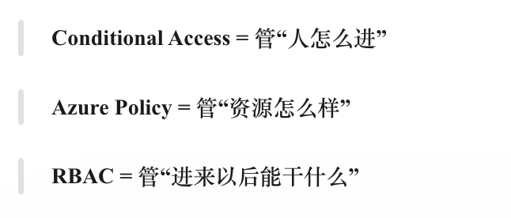

#### Azure authorization solutions (Role-Based Access Control)

1. Azure roles: Owner, Co-Contributor, Reader.
2. Microsoft Entra roles:

   | Built-in role | Description |
   | --- | --- |
   | Global Administrator | Can manage everything in Entra ID. |
   | User Administrator (listed as “global viewer” in the source notes) | Can manage users and groups. |
   | Helpdesk Administrator (listed as “user admin” in the source notes) | Can reset user passwords. |
   | Billing Administrator | Manages billing and payments. |
3. Conditional Access: A feature that strengthens security by adding conditions to Azure roles or Microsoft Entra roles.
4. **Microsoft Entra Privileged Identity Management (PIM): Protects Azure roles and Microsoft Entra roles from misuse of privileges.**
   1. **Provides just-in-time access: Assign a role when a user needs it and allow its use only during the active period.**
5. Azure Bicep is a domain-specific language for declaratively deploying Azure resources. It can define and deploy required components—such as management groups, subscriptions, and resource groups—in a structured, repeatable way. Bicep makes it easy to configure the Azure environment described in a scenario with minimal operational overhead.

#### Authentication and authorization for Azure Storage

1. ABAC (Attribute-Based Access Control): Supported only for Azure Blob and Azure Queue.
   1. Custom roles can use attributes such as tags as conditions to define access to individual data items in a storage account.
2. Access key: A 512-bit string that provides full access to a storage account.
3. SAS: A special string containing resource permissions and an expiration time.

   | SAS type | Description |
   | --- | --- |
   | Account SAS | Can access resources in one of the Azure Storage services—Blob, Files, Queue, or Table. Signed with a shared key. |
   | Service SAS | Can access resources across multiple Azure Storage services—Blob, Files, Queue, and Table. Signed with a shared key. |
   | User delegation SAS | Can access resources only in the Azure Storage Blob service. |

#### Application authentication and authorization

1. App registration: Creates an identity for an application running outside Azure in an Entra tenant.
2. Managed identity: Creates an app identity in an Entra tenant and assigns it to an application in Azure.
   1. A managed identity can be assigned to resources such as virtual machines, App Service, and Azure Functions, and passed to apps running within those resources.
   2. **Types of managed identities:**

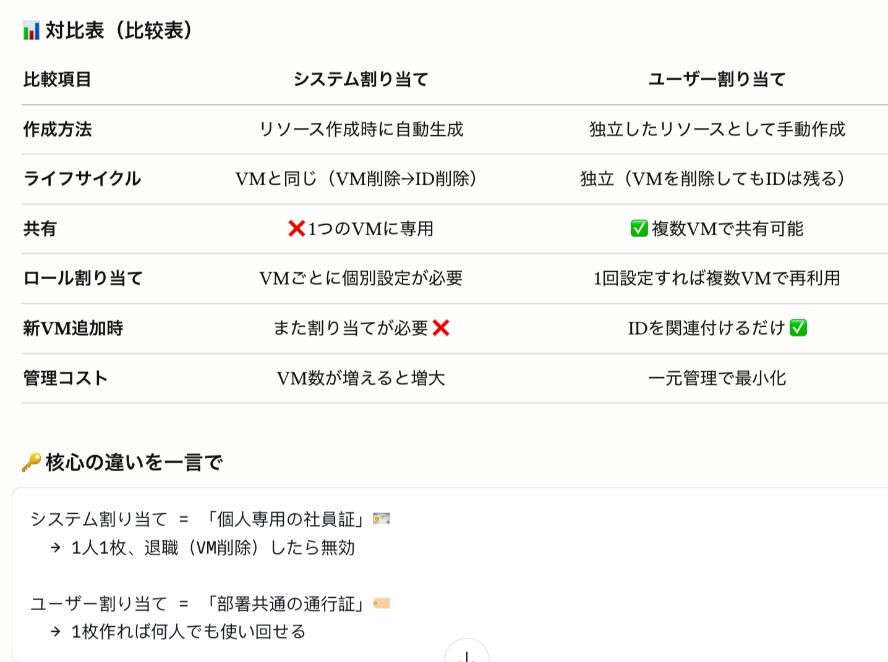

3. Service principal

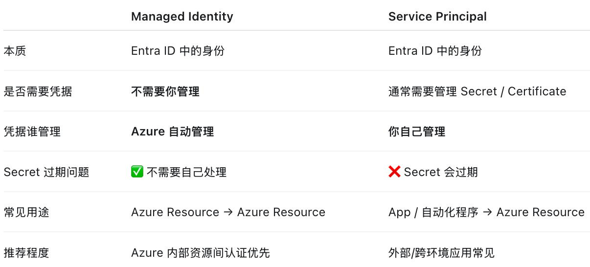

#### Compliance management solutions

Compliance management is the ongoing process of ensuring adherence to laws and organizational or industry guidelines.

1. Azure Policy: Governs Azure resources so that they comply with business rules.
2. Implementation steps:
   1. Policy definition:

      | Effect | Description |
      | --- | --- |
      | append | Allows a resource property to be appended/changed. |
      | deny | Blocks a change to a resource property. |
      | audit | Records an event in the Activity Log without changing the resource. |
      | auditIfNotExists | Records an event in the Activity Log if a related resource does not exist. |
      | deployIfNotExists | Creates a resource if a related resource does not exist. |
      | disabled | Disables the policy (for testing). |
      | modify | Changes resource tags. ⭐ Can change or add attributes such as tags. |
   2. Initiative definition.
   3. Assign a policy or initiative definition to a scope:
      - When there are many policy definitions, assigning each individually is cumbersome. An initiative definition groups multiple policies so they can be assigned together in one operation.
   4. Evaluation:
      - Azure Policy performs real-time evaluation when resources change and periodic background scans. Azure CLI or Azure PowerShell can also run an on-demand evaluation scan.

#### Secret management solution

1. Azure Key Vault:

   | Object | Description | Examples |
   | --- | --- | --- |
   | Secret | Stores general strings. | Passwords, database connection strings, API keys. |
   | Key | Stores encryption keys. | RSA keys, EC keys. |
   | Certificate | Stores X.509 certificates. | CA-issued certificates, self-signed certificates. |

### Design data storage solutions (20–25%)

#### Data solution fundamentals

1. Structured and unstructured data

   | Data type | Description | Examples |
   | --- | --- | --- |
   | Structured data | Data in a fixed format, governed by predefined rules (a schema). | Relational databases. |
   | Unstructured data | Data without a schema or fixed format. | Email, social media videos, images. |
   | Semi-structured data | Data that is unstructured but has some defined format. | XML, JSON. |
2. Storage is suitable for retaining unstructured data over long periods.

   |  | Block storage | File storage | Object storage |
   | --- | --- | --- | --- |
   | Description | Stores data in blocks. | Stores data as files. | Stores data as objects. |
   | Protocols | FC, iSCSI | CIFS, NFS | HTTP/HTTPS |
   | Examples | Disks such as hard drives and SSDs. | Windows or NFS file servers. | Azure Storage. |
3. Relational database = SQL database
   1. Manages data in multiple tables and defines relationships between the tables.
   2. A system for managing relational databases is an RDBMS (Relational Database Management System), for example MySQL, PostgreSQL, and MariaDB.
4. Non-relational database = NoSQL database
   1. A database designed for high volumes and low latency by relaxing some features, such as data consistency.

   | Data model | Description | Example database |
   | --- | --- | --- |
   | Key-value | Stores data as key-value pairs. | Redis |
   | Wide-column | Stores data as key-value pairs, with values spanning multiple columns. | Cassandra |
   | Document | Stores data in document formats such as JSON or XML. | MongoDB |
   | Graph | Stores entities (nodes) and relationships (edges). | Neo4j |

   |  | Relational database | Non-relational database |
   | --- | --- | --- |
   | Data type | Structured | Unstructured |
   | Schema | Required | Not required |
   | Access method | SQL queries | API |
5. Data warehouse: Stores structured data for analysis.

   ```text
   ERP ─┐
   SQL ─┼→ Data Warehouse → BI / Analysis
   CRM ─┘
   ```
6. Data lake: Stores raw data in its original format.

   |  | Data warehouse | Data lake |
   | --- | --- | --- |
   | Data types | Structured | Structured and unstructured |
   | Schema | Required | Not required |
   | Example sources | OLTP data, ERP data | IoT data, social media data |
7. Delta Lake: A storage layer based on Apache Spark, developed primarily by Databricks.

#### **Azure Storage**

1. **Azure Blob (Binary Large Object) Storage (containers)**: A massively scalable object store for text and binary data.
   - Storage tiers:
     1. Hot: Higher storage costs and lower access costs.
     2. Cool: Minimum storage duration of 30 days. Cold: Lower storage costs and higher access costs; intended for data that will remain cool for 90 days or more.
        - **To use the Cool access tier: Standard general-purpose v2 Blob Storage.**
     3. Archive: Lowest storage costs and highest retrieval costs. A blob in Archive is offline and cannot be read.
        - ✅ Supported accounts: **StorageV2 and Blob Storage**. StorageV1 is **not supported**.
        - ✅ Supported redundancy: **LRS/GRS/RA-GRS**. ZRS/GZRS/RA-GZRS are **not supported**.
        - ⚠️ **Premium BlockBlob** accounts do **not** support tier changes (deletion only).
        - ⚠️ Snapshots cannot be created in the Archive tier.
   - Immutable Storage: Lets users store business-critical data in a WORM (Write Once, Read Many) state. Data cannot be changed or deleted during the period specified by the user, protecting it from overwrites and deletion.
2. **Azure Files**: Managed file shares for cloud or on-premises deployments. Files can be accessed across multiple machines. Shared folders can be accessed via SMB (Server Message Block, port 445), not only through an API but also directly from Windows 10, macOS, and Linux.
   - **Authentication methods for the File service: SAS and Microsoft Entra.**
   - If **persistent storage** is required, mount a file share from a storage account and configure the container to store data outside the container.
   - **Azure Storage Explorer is a graphical tool for managing Azure Storage resources (Blobs, Files, Queues, Tables), but it cannot create new storage accounts.**
   - The only external volume supported by Azure Container Instances is an Azure file share created with Azure Files.

   | Tier | Description |
   | --- | --- |
   | Premium | File shares use SSDs and provide consistently high performance and low latency. Supports both Server Message Block (SMB) and Network File System (NFS) protocols. |
   | Transaction optimized | For transaction-heavy workloads where Premium file-share latency is not required. Provided on standard HDD-based storage hardware. |
   | Hot access tier | Optimized for general-purpose file shares, such as team shares. Provided on HDDs in standard storage hardware. |
   | Cool access tier | Low-cost storage optimized for online archives. Provided on HDD-based storage hardware. |
   - **Azure File Sync**: Caches data stored in Azure file shares (files in Azure Storage) on Windows Server for use. For an on-premises deployment, an Azure file share is required in the deployment region.
     - Extends an on-premises file server to the cloud.
     - Centralizes management in the cloud and shares data across multiple sites.
     - Supports backup and disaster recovery.
3. **Four replication strategies:**

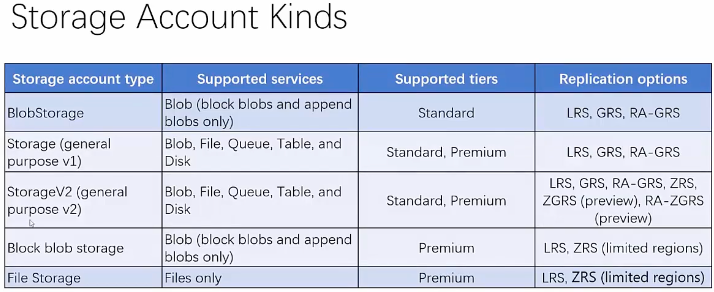

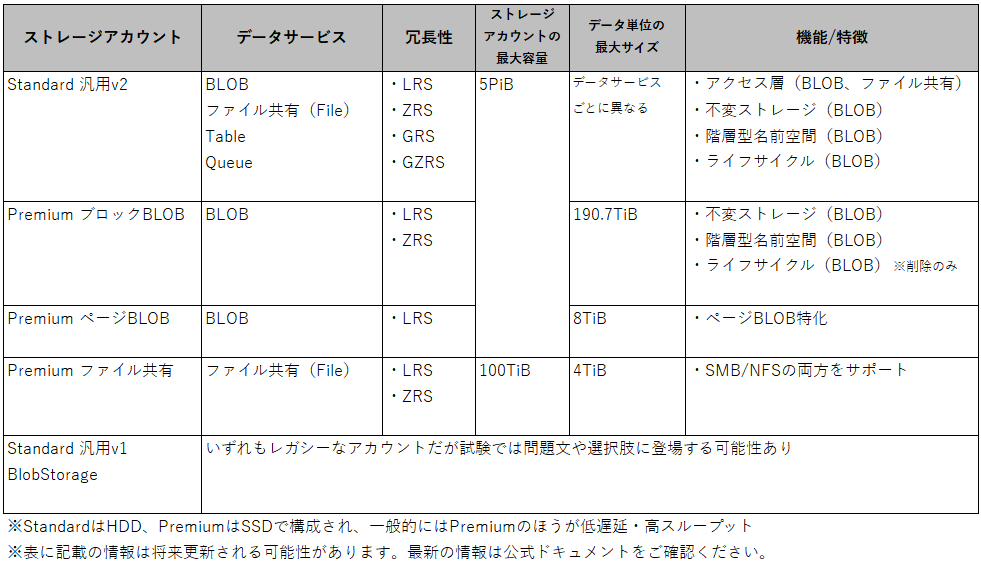

   - **SMB Multichannel is available only for Premium Azure Files.**
   - **Standard general-purpose v2 supports Zone-Redundant Storage (ZRS), and you can convert from LRS to ZRS in the Azure portal.**
   - Failover is relevant only for storage accounts with cross-region redundancy enabled, such as GRS/GZRS.

#### Azure SQL Database

1. Azure SQL Database: A single database, suitable for new cloud applications.
   - Two primary pricing options for SQL Database:
     - **DTU (Database Transaction Unit) is a combined measure of compute, storage, and I/O resources.**
     - **A vCore is a virtual core. You choose the number of virtual cores and have greater control over compute costs.**
2. A single Azure SQL Database supports serverless and elastic pool options.
   - **Serverless mode:**
     - Automatically scales CPU up or down based on workload. ✅
     - Automatically pauses when there are no queries. ✅
     - Charges based on actual usage time in seconds. ✅ Meets a “per-second billing” requirement.
   - Supported in General Purpose and Hyperscale tiers.
3. Azure SQL Managed Instance: A PaaS deployment option for Azure SQL. Like Azure SQL Database, it is fully managed, and it provides a SQL Server instance while greatly reducing VM management overhead. Suitable for migrating on-premises SQL Server.
4. SQL Server on Azure Virtual Machines: SQL Server running on an Azure virtual machine (VM). Use the full version of SQL Server in the cloud without managing an on-premises machine.
   1. One feature is that on-premises Microsoft SQL Server can be migrated to Azure with minimal effort.

| Comparison | SQL Database | SQL Managed Instance | SQL Server on Azure Virtual Machines |
| --- | --- | --- | --- |
| Scenarios | Best for modern cloud apps, large-scale configurations, or serverless configurations. | Best for most instance-level features needed when migrating to the cloud. | Best for apps that need a fast migration or OS-level access. |
| Features | Serverless compute; fully managed service; elastic pool; **optimized for OLTP**. | Native virtual networks; fully managed service; instance pool; **supports CLR (Common Language Runtime)**. | OS-level server access; broad SQL Server version support. |

- The Business Critical tier of Azure SQL Database is optimized for high-performance OLTP workloads. It is suitable when the fastest recovery is needed after a failure. In-memory technology and fast database recovery help minimize downtime.
- Azure SQL Database Hyperscale is suitable for multiple read-only replicas (read scale-out):
  - Multiple read-only replicas.
  - Automatic data synchronization/replication.
  - Read scale-out.
  - Fast failover.
  - Optimized for online transaction processing (OLTP).

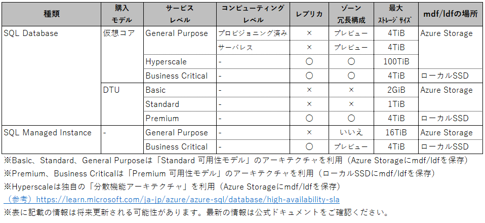

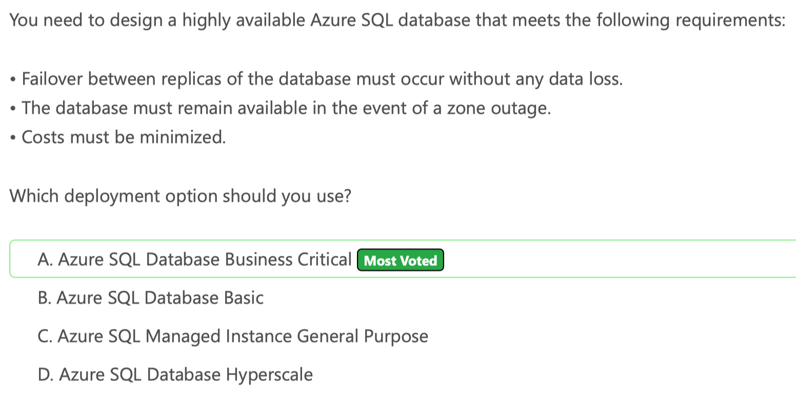

1. Azure SQL Database security
   1. Azure SQL Database audit logs: When enabling audit logs in the Azure portal and selecting or creating a storage account, note that the storage account is limited to the same region as the database or server.
   2. Firewall: Specify the IP addresses allowed to connect to SQL Database.
   3. Access control.
   4. Row-Level Security (RLS): Controls which rows a user can view.
   5. Dynamic Data Masking: Protects privacy by masking Personally Identifiable Information (PII), such as phone numbers and addresses.
   6. Encryption in transit: Encrypts communication between clients and Azure SQL Database using SSL/TLS.
   7. Transparent Data Encryption: Encrypts the entire Azure SQL Database. There are default and customer-managed keys. If using your own key, supported options include asymmetric RSA and RSA HSM; key sizes of 2048 and 3072 are supported.
   8. Always Encrypted: Encrypts sensitive data on the client before writing it to an Azure SQL Database.

#### Azure non-relational databases

1. Azure Cosmos DB: A globally distributed NoSQL database.
   1. Supports many NoSQL database APIs: NoSQL, MongoDB, Apache Cassandra, Apache Gremlin, and Table.
      - Supports SQL commands.
      - Supports multi-master writes.
      - Guarantees low-latency read operations.
   2. Design parameters:
      1. Request Unit (RU): A unit for measuring database operation throughput in Cosmos DB.
      2. Capacity modes:
         - Provisioned throughput mode: Set the Request Units (RUs) yourself.
         - Autoscale mode: RUs change automatically according to load.
         - Serverless mode: No RU configuration is needed (pay as you go).
      3. Access control:
         - RBAC: Access control using Azure RBAC with Entra ID users and groups.
         - Primary/secondary keys.
         - Resource tokens: Provide temporary access to a specific database, container, or item.
   3. Azure Cosmos DB supports two kinds of databases: NoSQL and SQL. For NoSQL:
      1. SQL API is ideal for processing JSON documents. It stores JSON data natively and lets you query it using SQL syntax, providing efficient and flexible handling of JSON documents.
      2. Gremlin API is designed for graph data and optimized for graph traversals and queries.
      3. Cassandra API is designed for the column-family data model and is suitable for structured data with a fixed schema.
      4. MongoDB API is suitable for efficiently storing and querying JSON documents.
2. For SQL with Azure Cosmos DB: Azure Cosmos DB for PostgreSQL.

   Using the Azure Cosmos DB service foundation, PostgreSQL databases can be distributed across multiple regions. Horizontal scaling provides high performance, and multiregion replication provides high availability.

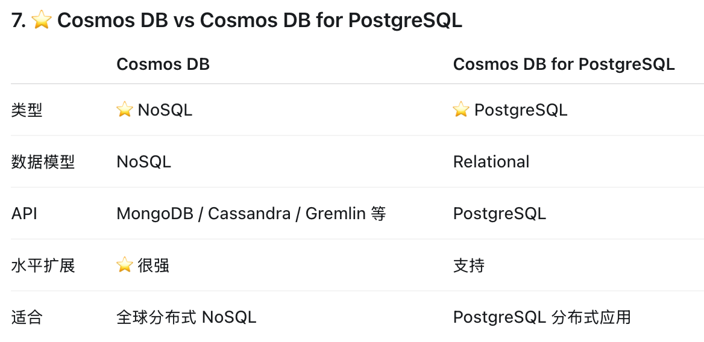

#### Data analytics solution fundamentals

1. Apache Hadoop consists primarily of two important parts: Hadoop = distributed storage + distributed computing.
   - **HDFS** (Hadoop Distributed File System) → stores data.
   - **MapReduce** → distributed data processing.
2. Apache Spark improves on Apache Hadoop. It can process all data quickly in memory, enabling **real-time analytics**. Spark is a **data processing/analytics engine**, not a database.

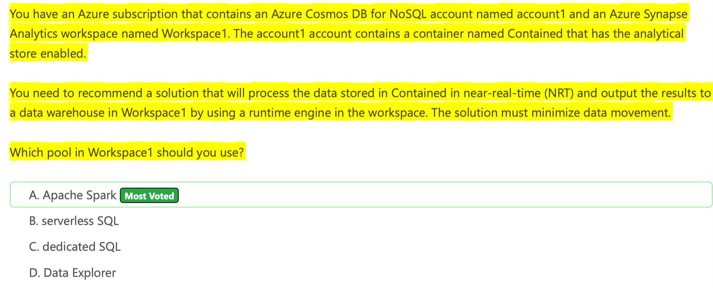

3. Databricks: A data analytics platform based on Apache Spark.

#### **Azure data analytics solutions**

1. Data analytics flow: **Move data with ADF → store in ADLS → transform with Databricks/Spark → analyze with Synapse → display with Power BI.**

   | Analytics step | Description | Main Azure services |
   | --- | --- | --- |
   | Ingest | Collect data from various sources. | Azure Data Factory ⭐ Ingestion/movement/transformation; Azure Synapse Analytics ⭐ Analytics data warehouse. |
   | Prep & Train | Prepare and transform data for analytics and machine learning. | Azure Databricks ⭐ Spark data processing/machine learning; Azure Synapse Analytics (Spark pool). |
   | Model & Serve | Store organized data in an analytics store. | Azure Synapse Analytics (SQL pool); Azure Analysis Services ⭐ Multidimensional analysis; Azure Data Explorer ⭐ Near-real-time analysis of large volumes; Azure Data Share ⭐ Data sharing with other organizations; Azure Machine Learning; Power BI. |
2. **Azure Data Factory: A cloud-based data integration service. It creates and schedules data-driven workflows, orchestrates data movement, and performs large-scale data transformations. Pipelines ingest data from a variety of data stores.**
   - Azure Data Factory transforms collected data and stores it elsewhere. **Extract, Transform, Load (ETL) is data integration.** SSIS = SQL Server Integration Services.
   - **To transform data with Azure Data Factory and export it to Azure Data Lake Storage, the Integration Runtime data movement engine is required. Azure Data Factory (ADF) can host and run SSIS packages using the Azure-SSIS Integration Runtime.**

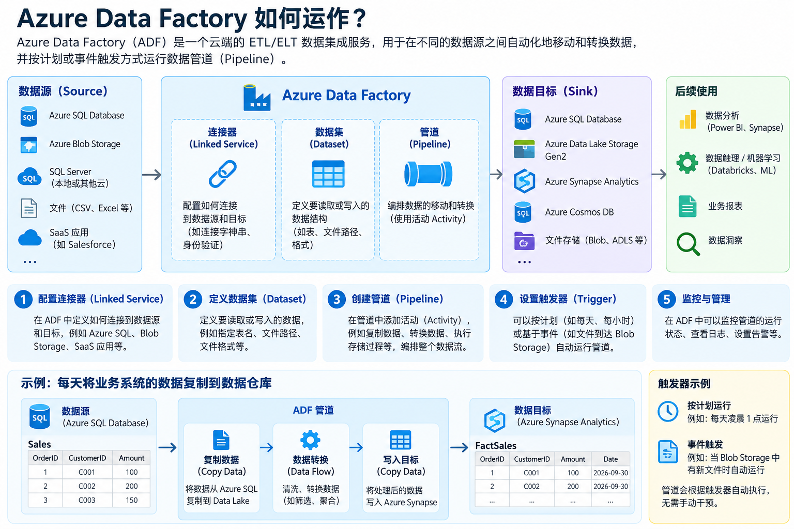

3. **Azure Data Lake: Data is usually stored in its natural format as blobs or files. Azure Data Lake Storage combines a file system with a storage platform so you can get insights from data quickly. It is built on Azure Blob Storage and optimized for analytics workloads.**

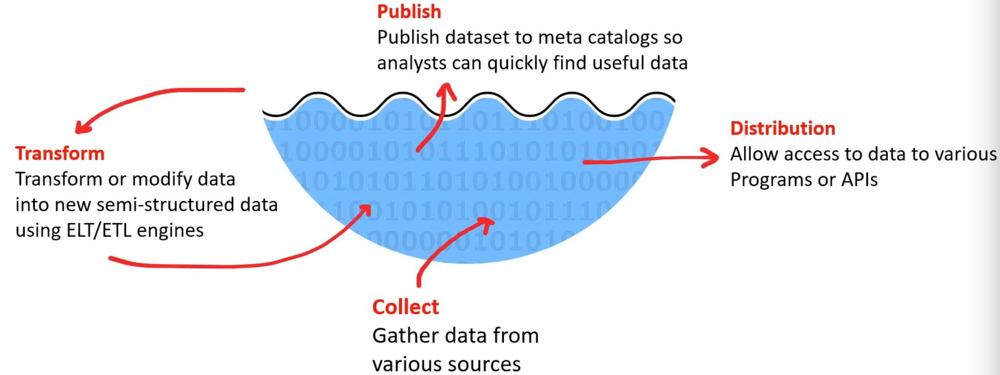

   - Azure Data Lake Storage characteristics:
     - Hierarchical namespace.
     - Scalability.
     - Security: Azure AD for identity and access management, RBAC, and more. Also supports Azure Private Link.
     - **Supports immutable storage.**
     - **Disable anonymous access.**
     - **Supports Azure AD permissions based on access control lists (ACLs).**
   - Three important Azure Data Lake Storage steps:
     - Ingest data:
       - For unplanned data, use tools such as AzCopy, Azure CLI, PowerShell, and Azure Storage Explorer.
       - For relational data, use Azure Data Factory. Data can be transferred from any source, such as Azure Cosmos DB, SQL Database, and Azure SQL Managed Instance.
       - For streaming data, use tools such as Apache Storm on Azure HDInsight and Azure Stream Analytics.
     - Access stored data: The easiest way to access data is Azure Storage Explorer, a standalone GUI application for Azure Data Lake data. You can also use PowerShell, Azure CLI, **HDFS** CLI, and language SDKs.
     - Configure access control: Set authorization to control who can access data in Azure Data Lake Storage. Choose Azure RBAC or ACLs.
     - Compare Azure Blob Storage and Azure Data Lake.
4. **Azure Databricks SKU: A fully managed cloud big data and machine learning platform that accelerates AI and innovation for developers.**
   - Azure Databricks has a control plane and a data plane.
     - **Azure Databricks offers Standard and Premium pricing tiers. The Premium plan is required to use Azure Data Lake Storage credential passthrough.**
   - Service principal: Configure a service principal to authenticate an application accessing an Azure Databricks workspace. It is a security identity for an app or service accessing Azure resources. It enables secure authentication without storing credentials in the app, reducing management overhead and improving security.
     - Use for big data analytics, machine learning, real-time analytics, ETL processes, data exploration, and visualization.

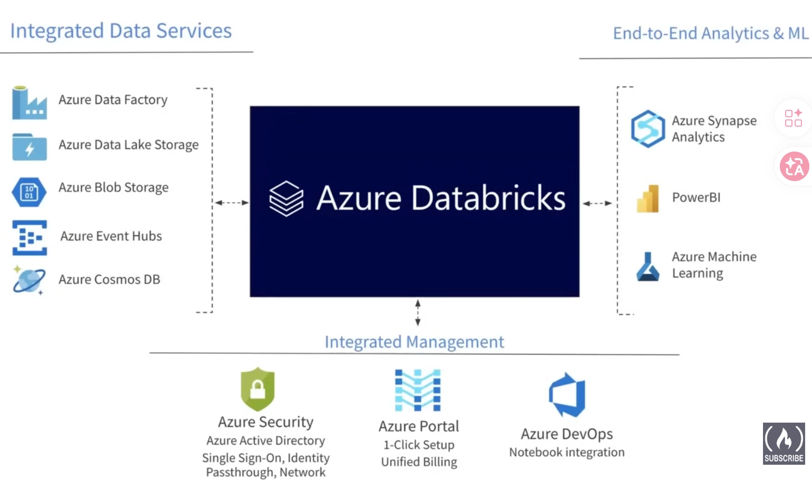

5. Azure Synapse Analytics: Combines big data analytics, enterprise data warehousing, and data integration. It can query serverless and large-scale data. It supports data ingestion, exploration, transformation, and management, as well as BI and machine learning analytics.

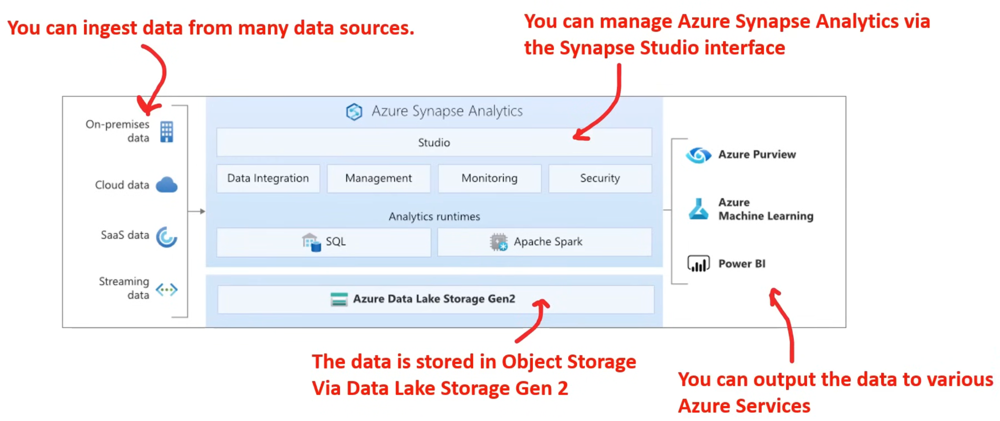

   - Azure Synapse Analytics components:
     - Azure Synapse SQL pool: Provides serverless and dedicated-resource models and supports a node-based architecture. Use a dedicated SQL pool when predictable performance and cost are needed; use the always-available serverless SQL endpoint for intermittent or unpredictable workloads.
     - Azure Synapse Spark pool: A server cluster for processing data with Apache Spark. Processing logic can be written in Python, Scala, SQL, or C# (the .NET language for Apache Spark). Apache Spark in Synapse integrates an open-source engine for data preparation, data engineering, ETL, and machine learning.

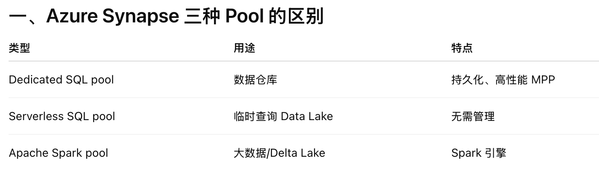

     - Azure Synapse Pipelines:
       - Read data from sources such as SQL Server.
       - Copy data to Azure Data Lake Storage Gen2.
       - Transform data during movement with Mapping Data Flow or similar tools.
       - Write transformed data to the target Data Lake.
     - Azure Synapse Link: **A component that connects to Azure Cosmos DB. It enables near-real-time analytics on operational data stored in Cosmos DB.**

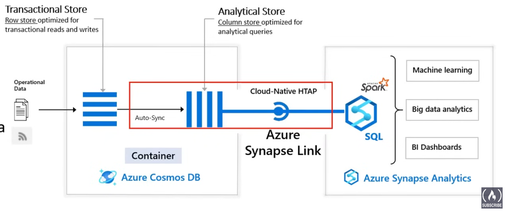

     - Azure Synapse Studio: A web-based integrated development environment (IDE). It provides centralized access to Azure Synapse Analytics features. You can create SQL/Spark pools, define and run pipelines, and configure links to external data sources.
   - Managed workspace virtual network: Managed by Azure Synapse Analytics on the user's behalf, reducing the need to manage security, performance, and other aspects.
6. Azure Analysis Services: Performs Online Analytical Processing (OLAP).
7. Azure Machine Learning: A managed service for building and deploying ML models.
8. **Azure Data Explorer: An all-in-one service for ingesting, analyzing, and visualizing large volumes of data in near real time. Suitable for large volumes of data and near-real-time analytics.**
9. Azure Data Share: Provides access to snapshots of data in ADLS Gen2, Azure Synapse Analytics, Azure SQL Database, and other sources, with restricted access for sharing.

### Design business continuity solutions (15–20%)

#### **Azure Site Recovery**

1. Recovery time objective (RTO): The maximum time allowed to restore resources after an outage or problem. Taking longer than the RTO may result in financial penalties or business disruption. It can be set for the whole solution (all resources) or for individual components such as a SQL Server instance or database.
2. Recovery point objective (RPO): Indicates how far back a database must be restored and corresponds to the maximum acceptable data loss. For example, if an IaaS VM running SQL Server fails at 10:00 a.m. and the database RPO is 15 minutes, recovery can lose no more than 15 minutes of data; it must restore to a point at or after 9:45 a.m. Whether the RPO can be met depends on several factors.
3. Recovery Level Objective (RLO): The target recovery level. RLO is used together with RTO, defining an RTO for each RLO level.
4. Azure Site Recovery replication methods:

   | Type | Description | Replication interval |
   | --- | --- | --- |
   | Crash-consistent snapshot | Replicates only the virtual machine disk data. | Every 5 minutes. |
   | App-consistent snapshot | Replicates virtual machine disk data while accounting for application activity. | Every 1–12 hours. |

### Design business continuity solutions

1. Availability Sets: Keep systems available during planned maintenance or a single point of failure within an Azure datacenter.
   - **Availability Set**
     - An availability set is created as a dedicated resource and assigned when the virtual machine is created. **Availability sets cannot be assigned or changed after the VM has been created.**
     - Availability set parameters:
       - **Update Domain: Up to 20 update domains can accommodate planned maintenance of the host server.**
       - **Fault Domain: Accommodates server rack failures. The maximum number of fault domains is 3.**

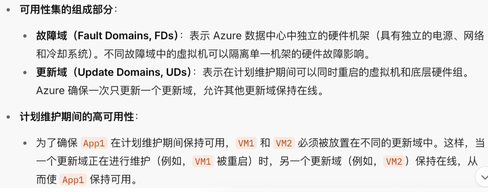

2. **Availability Zones allow a service to continue in another datacenter if an entire datacenter in the region fails.**
   - The number of available regions is limited. In Asia, only East Asia and Southeast Asia are available.
   - Virtual machines with unmanaged disks are not supported by Availability Zones, so convert them to managed disks in advance.
     - Managed disk: The disk is created in a storage account managed by Azure.
     - Unmanaged disk: The disk is created in a storage account managed by the user.

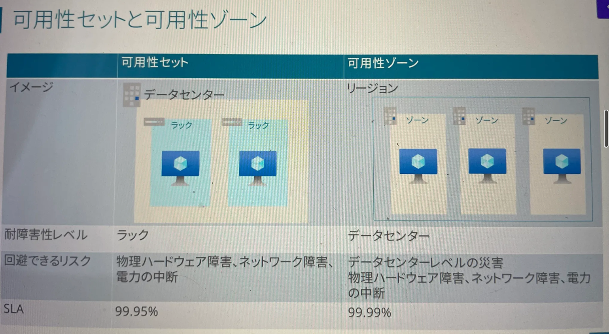

3. Virtual Machine Scale Sets: Create and manage multiple virtual machines together within a single region. Includes health monitoring and an automatic repair policy.
4. Azure Backup
   - Backup steps:
     - Create a Recovery Services vault. **The number of Recovery Services vaults depends on the number of regions containing virtual machines and file shares.**
     - Configure a backup policy. **A separate backup policy must be created for each resource type being backed up (for example, VMs and file shares require separate policies): Recovery Services vault × policy type.**
     - Install and register the backup agent.
     - Run the backup.
   - Differences between on-premises backup options:

     | Option | Features | Limitations | Storage |
     | --- | --- | --- | --- |
     | Azure Backup Agent | Backs up Windows OS folders and files; no dedicated server required. | No Linux support; backs up folders and files only. | Recovery Services vault. |
     | Azure Backup Server | Supports application-consistent backups; supports Windows and Linux. | Requires a dedicated server. | Recovery Services vault and local disk. |
   - **Azure Backup can back up only to a vault in the same region. Recovery Services vaults do not support backing up blobs.**
     - **Storage accounts can be in a different region.**
     - **Log Analytics workspaces must be in the same region.**
   - **There are two types of Azure Backup vaults:**
     - **Recovery Services vault: Can back up all disks attached to a virtual machine (the entire VM), but cannot exclude the OS disk and back up only the data disks.**
     - **Backup vault: To back up managed disks for a virtual machine, first create a “Backup vault.”**

   |  | Azure Backup | Azure Site Recovery |
   | --- | --- | --- |
   | Core function | Backup and restore | Replication and failover |
   | Maximum recovery point retention | 99 years | 15 days |
   | Minimum RTO | Depends on VM size (can be 24 hours or more) | Within 2 hours |
   | Minimum RPO | 24 hours (Standard); 4 hours (Enhanced) | 5 minutes (crash-consistent); 1 hour (app-consistent) |

#### Storage business continuity solutions

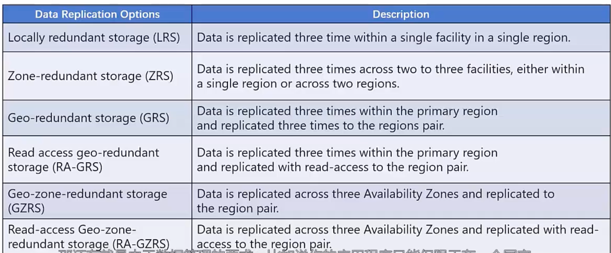

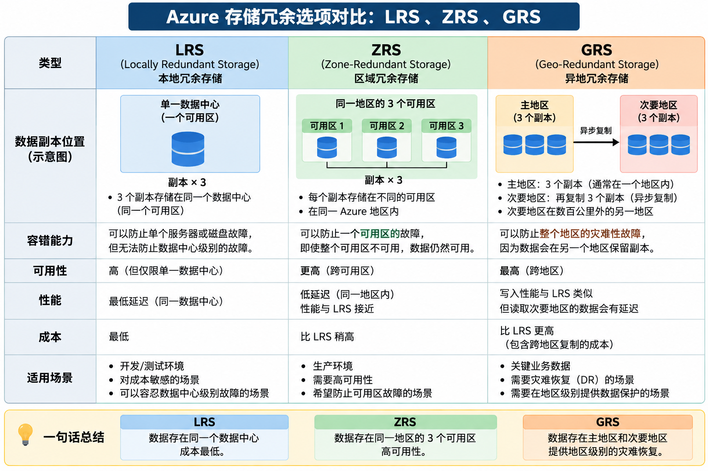

#### **Application business continuity solutions**

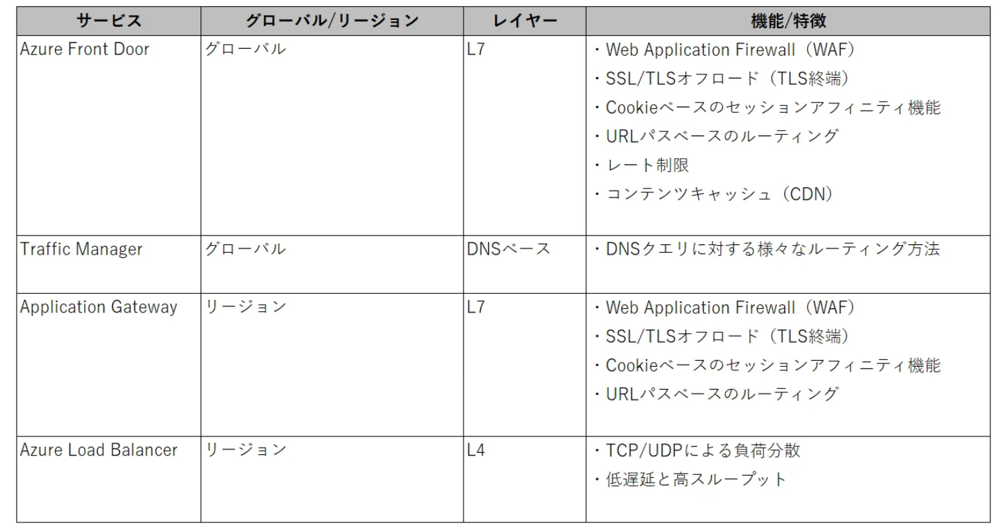

- **Requirement: How can Azure Web App services continue during a regional outage?**
  - **⭐ To prepare for an outage affecting an entire region, use a global service → Azure Front Door or Traffic Manager.**
- **Azure Front Door and Azure CDN are mainly used to cache static content (such as JavaScript, CSS, and image files), not data in a backend database.**

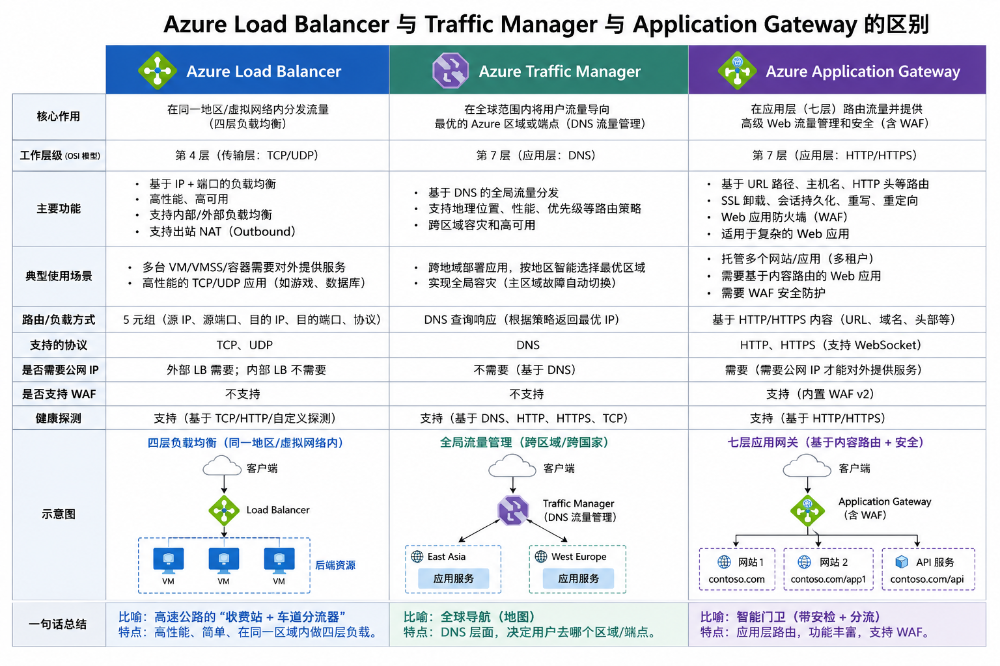

Azure Load Balancer and Azure Application Gateway can load-balance traffic within a region.

Azure Traffic Manager and Azure Front Door can load-balance traffic across regions.

Azure Application Gateway and Azure Front Door can offload SSL processing.

#### Azure Key Vault business continuity solution

1. Key Vault replication:
   - If a failure occurs, failover to the paired region happens automatically; no action is required.
   - During failover, the vault becomes read-only. Allowed: Encrypt, Decrypt, Backup. Not allowed: Create, Update, Delete.
2. Backing up objects:
   - ⭐ **A backup can be restored only to a Key Vault in the same region as the original Key Vault.**

### Design infrastructure solutions (30–35%)

#### Design computing solutions

1. Virtual machine services:

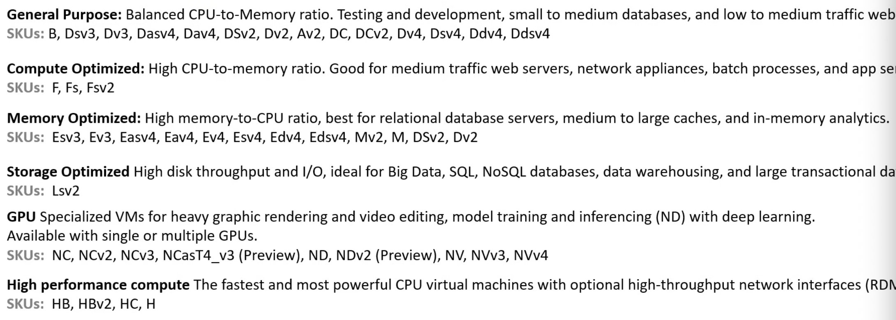

- VM bursting:
  - B-series VMs support **Burst performance**. They run at lower CPU performance during low demand and dynamically increase CPU performance during high demand.
- VM disk types:

  | Disk type | Maximum disk size | Maximum throughput | Maximum IOPS | Description |
  | --- | --- | --- | --- | --- |
  | Standard HDD | 32 GB | 500 MB/s | 2,000 | HDD-based. |
  | Standard SSD | 32 GB | 750 MB/s | 6,000 | SSD-based. |
  | Premium SSD | 32 GB | 900 MB/s | 20,000 | SSD-based. |
  | Premium SSD v2 | 64 GB | 1,200 MB/s | 80,000 | SSD-based; cannot be used as an OS disk. |
  | Ultra Disk | 64 GB | 10,000 MB/s | 400,000 | SSD-based; cannot be used as an OS disk. |
2. Azure App Service
   - App Service plan: Defines settings such as pricing tier, OS type, and redundancy. (It does not support multiple regions; **an App Service plan must be created for each region**.)

     | Plan | Description |
     | --- | --- |
     | Free | Free plan; no SLA. |
     | Shared | More allocated resources than Free; no SLA. |
     | Basic | For small workloads. |
     | Standard | For medium-sized workloads. |
     | Premium | For large workloads. |
     | Isolated | Provides a fully isolated, dedicated environment using a virtual network. |
   - Deployment slot: An Azure App Service feature that hosts multiple versions of an application simultaneously (App Service plan Standard or higher).
     - **Hosts multiple versions of a single web app simultaneously.**
     - **Available for App Service plans with SKUs Standard or higher.**
     - **You can revert to the previous version by swapping the slot.**
   - Service Connector: Connects Azure App Service to other Azure services.
3. Azure Container Service

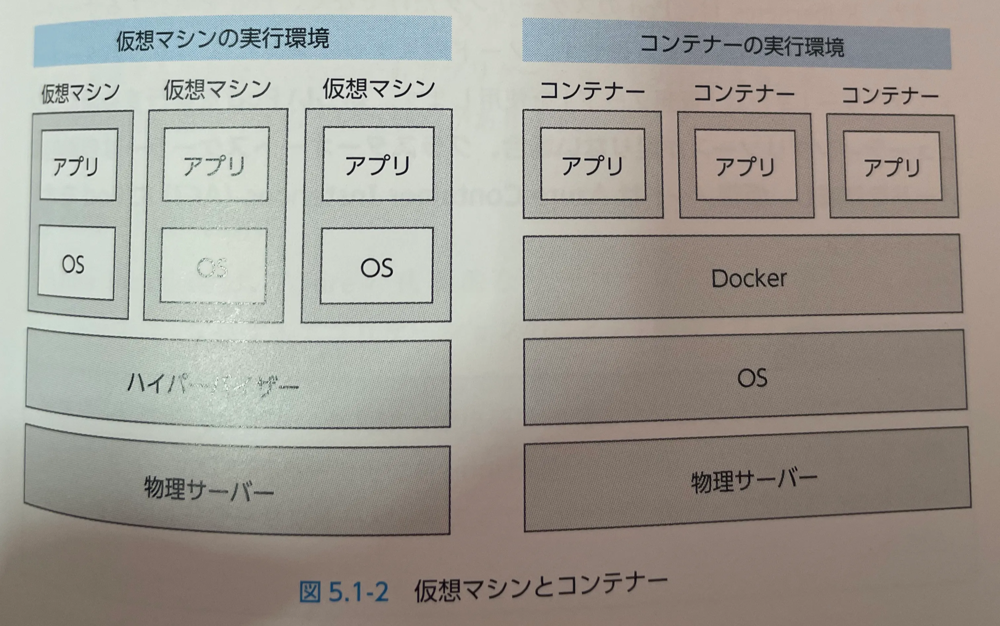

   - **Azure Container**

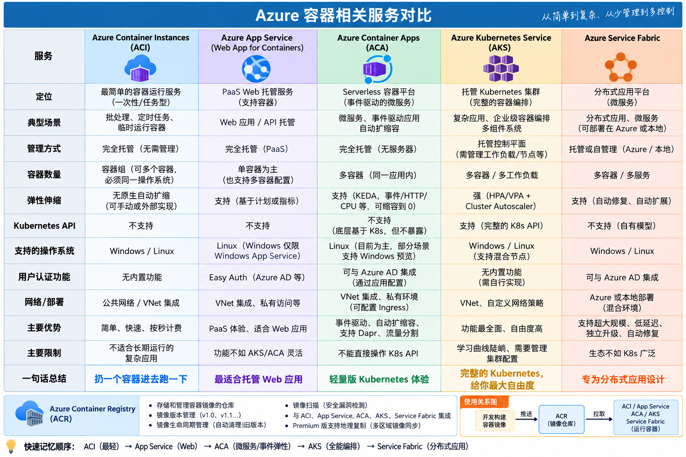

4. Serverless services: Services in which the cloud provider supplies the servers needed to run an app, so the user does not prepare servers.
   - Azure Functions: **Serverless + event-driven**

     | Pricing plan | Description |
     | --- | --- |
     | Consumption plan | On-demand pay-as-you-go based on the number and duration of executions. Maximum app execution time: 10 minutes. |
     | Dedicated hosting plan | Fixed-price plan that provides dedicated resources to run the app. Maximum app execution time: 10 minutes. |
     | Premium plan | A type of consumption plan with additional features, such as virtual network access. Maximum app execution time is extended to 30 minutes. |

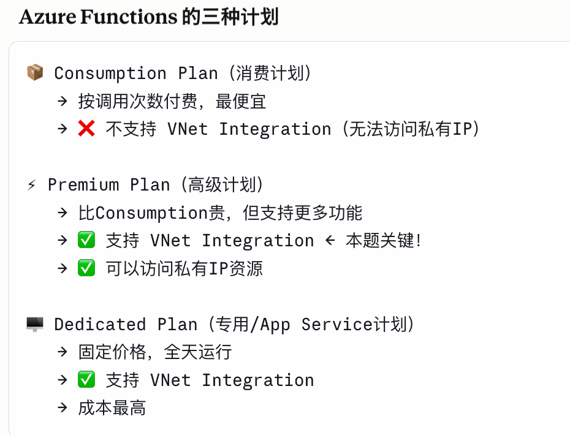

5. Batch processing services:
   - Azure Batch: Ideal for moving cloud-optimized high-performance computing (HPC) workloads running on-premises to the cloud. It efficiently runs large-scale parallel processing and HPC applications, and provides job scheduling, automatic compute resource scaling, and task management.
   - Node types:

     | Type | Description |
     | --- | --- |
     | Low-priority VM | Low-cost VM using Azure spare capacity. Suitable for short-running, non-time-critical tasks such as development environments. |
     | Spot VM | Similar to low-priority VMs. Low-priority VMs are being retired, so migration to Spot VMs is recommended. |
     | Dedicated VM | Dedicated virtual machine, suitable for long-running production tasks. |

     In Azure Batch, you can manage the pool yourself or let Azure Batch manage it. This is determined by the “pool allocation mode” specified when creating the pool.

     | Type | Description |
     | --- | --- |
     | User Subscription | The user manages the pool and specifies VM sizes and counts. Dedicated or Spot VMs can be used. The Azure Hybrid Benefit can be used to apply on-premises Windows Server licenses in Azure. |
     | Batch Service | The default mode, in which Azure Batch manages the pool. Dedicated or low-priority VMs can be used. |
   - **Azure CycleCloud: Deploys and manages large HPC clusters. It can use industry-standard third-party schedulers, making migration from on-premises easier.**

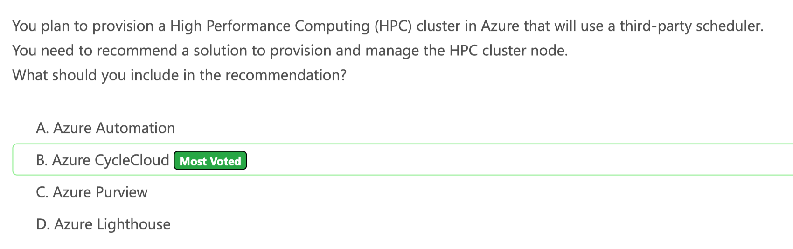

#### Design application architecture

1. Messaging architecture
   - Azure Queue Storage: A one-to-one service between sender and receiver.
     - Enables **asynchronous communication** for transactions between cloud services.
   - Azure Service Bus: When there are multiple receivers, configure a single Azure Service Bus topic to send and receive messages using the publish/subscribe (Pub/Sub) pattern. **Service Bus queues provide one-to-one communication; Service Bus topics provide one-to-many communication.**
     - Enables **asynchronous communication** for transactions between cloud services.
     - Enabling sessions on an Azure Service Bus queue guarantees FIFO (first in, first out), so messages are received in the order they were sent.
2. Event-driven architecture

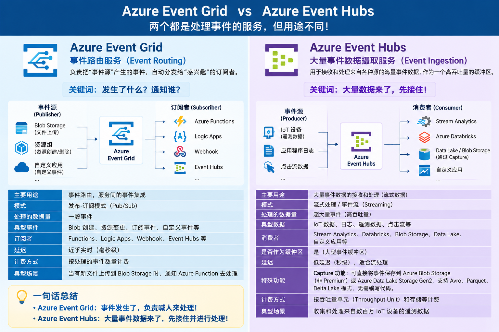

3. Cache solutions

   There are two types of caches, depending on where they are placed:

   1. Content cache: Placed between the client and web app to cache web content such as HTML pages.
   2. Data cache: Placed between the web app and database to cache data such as database contents.

   - Azure Content Delivery Network: Azure CDN caches web content at distribution servers called PoPs around the world. ⭐ **For web content.**
   - Azure Cache for Redis: An in-memory database that caches all data in memory for fast processing. ⭐ **For database/application data.**
4. Integration solutions
   - Azure API Management: Centrally manages and protects API requests to backend services provided by apps on virtual machines or containers, Azure Functions, and other services.
     - Azure API Management has several pricing tiers. The Premium tier supports virtual networks.
     - **Azure API Management:**
       - Needed for **API rate limiting**.
       - Needed to support external/third-party authentication.
       - Needed when backend services (such as Logic Apps/Function Apps) should not be changed.
       - OAuth/JWT (JSON Web Token) validation.

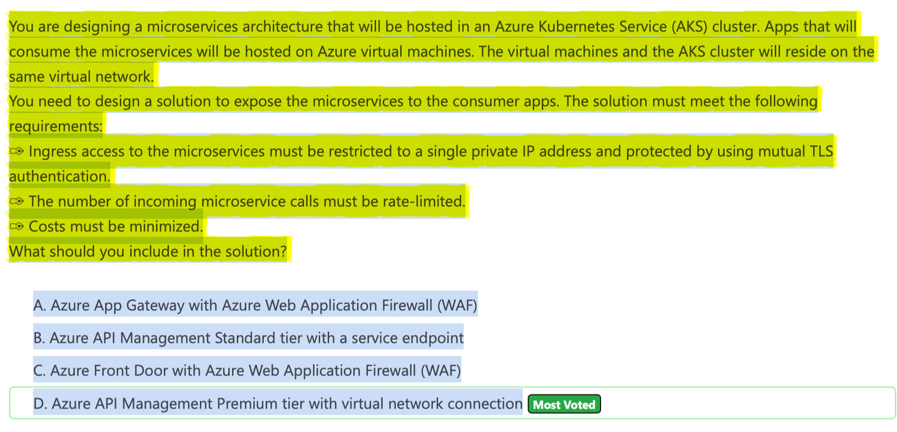

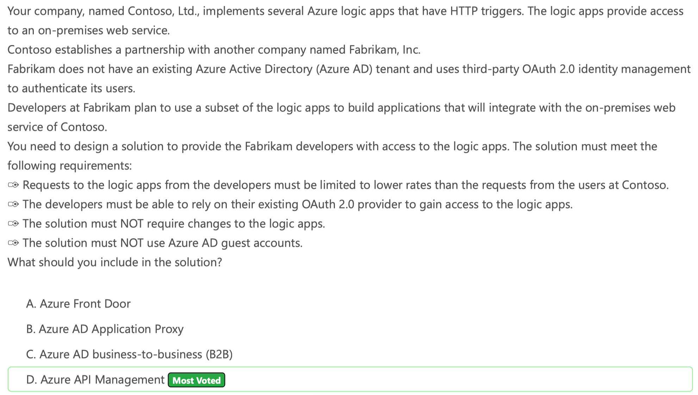

   - **Azure Logic Apps:** A service for easily creating workflows that connect multiple cloud services on the internet. **Workflow automation.**
     - **Overview**: A **low-code/no-code workflow orchestration tool**. Connects multiple systems/services using **visual drag-and-drop**.
     - **Features**:
       - Includes hundreds of **connectors** for services such as Office 365, SharePoint, Salesforce, SQL Server, and Twitter.
       - Suitable for **business process automation** and can be used without writing code (though code can also be written).
       - Has more features than Functions and is suitable for complex, multi-step business processes.
     - **Typical example**: “When a file is uploaded to SharePoint, email the manager → after approval, automatically register it in a SQL database”—a multi-step business workflow.
     - **Difference from Functions**:
       - Functions: **Write code**; suitable for a single technical or logical task.
       - Logic Apps: **Configure with drag and drop**; suitable for coordinating business workflows and integrating multiple SaaS systems.
     - **In one sentence**: **“Connect multiple systems with drag and drop, without writing code.”**
5. Application configuration management solutions
   - Azure App Configuration and Azure Key Vault both manage settings and parameters. Azure App Configuration specializes in managing app configuration; Azure Key Vault specializes in managing secrets.

#### Data migration

1. Azure Migrate migrates an entire IT environment from on-premises or another cloud to Azure.
   - VMs
   - Physical servers
   - Databases
   - Web apps
   - Virtual desktops
2. AzCopy: **Copies Blob/Files/Storage data.**
3. Azure Data Share: Shares data with other organizations/users and shares and updates it periodically.
4. Azure Import/Export: Transfers data offline between on-premises storage and Azure Storage.
5. Azure Data Box: A physical device provided by Microsoft for transferring large amounts of data.

#### Design database migrations

1. Azure Data Studio: A database management tool that runs on Windows, macOS, and Linux.
   - Supports Microsoft SQL Server and Azure SQL Database by default; MySQL, PostgreSQL, Azure Cosmos DB, and others are available as options.
   - Installing the **Azure SQL migration extension** supports migration from Microsoft SQL Server to Azure SQL Database or Azure SQL Managed Instance.

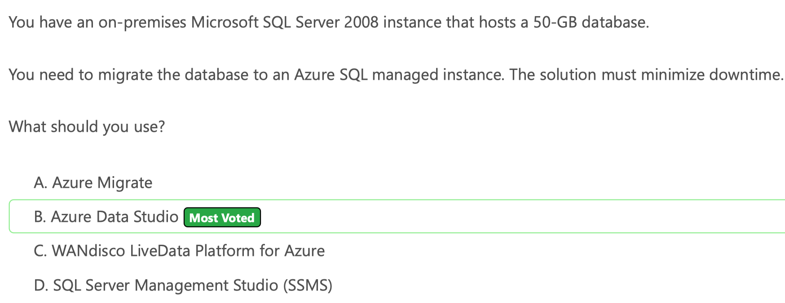

2. Azure Database Migration Service (DMS): A dedicated database migration service. ✔ Supports **offline migration**. ✔ Supports **bulk migration (50 databases)**.

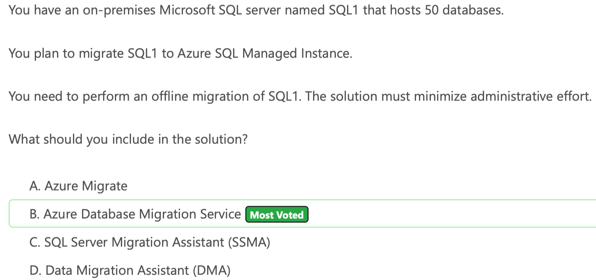

3. Data Migration Assistant (DMA) is a pre-migration assessment tool and a SQL Server migration tool.
4. SQL Server Migration Assistant (SSMA): A tool that supports migration from **non-SQL Server** sources (Microsoft Access, DB2, MySQL, Oracle, SAP ASE) to SQL Server.

   → A tool for bulk migration of other databases such as Oracle and MySQL to SQL Server.

5. The Azure Cosmos DB data migration tool makes it easy to migrate data to **Azure Cosmos DB**.

| Task | Azure Data Studio | DMS | DMA | SSMA | Azure Migrate |
| --- | --- | --- | --- | --- | --- |
| Assess migration | ⭕️ |  | ⭕️ |  | ⭕️ |
| Migrate SQL Server to Azure SQL Database | ⭕️ | ⭕️ | ⭕️ |  |  |
| Migrate SQL Server to SQL Server on an Azure VM |  |  | ⭕️ |  |  |
| Shift SQL Server to SQL Server on an Azure VM |  |  |  |  | ⭕️ |
| Migrate non-SQL objects |  |  |  | ⭕️ |  |
| Migrate open-source data |  | ⭕️ |  |  |  |

#### Design networking solutions

1. Virtual network: A virtual network is created for each region.
2. Internet connectivity solutions: For inbound traffic from the internet.
   - Public IP address.
   - Azure Load Balancer: Performs health probes and load-balances virtual machines.
   - Azure Application Gateway.
   - Azure NAT Gateway: Outbound only + ⭐ **connects private VMs to the internet.**

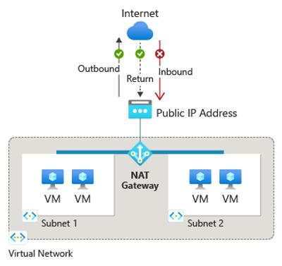

3. On-premises network connectivity solutions:
   - Azure VPN Gateway: A VPN device deployed in a virtual network.

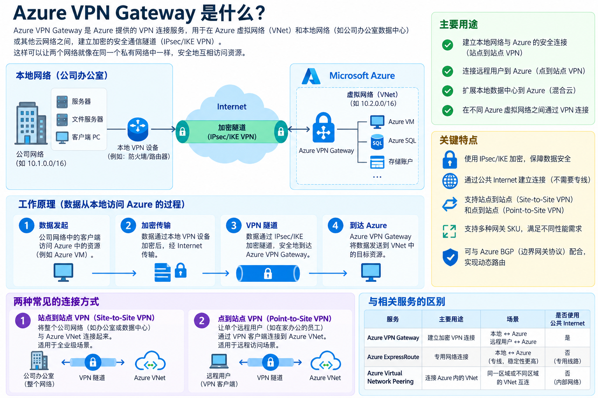

   - Azure ExpressRoute: A private connection between on-premises and Azure. Compared with an internet VPN, it offers “higher reliability,” “higher speed,” and “lower latency.”

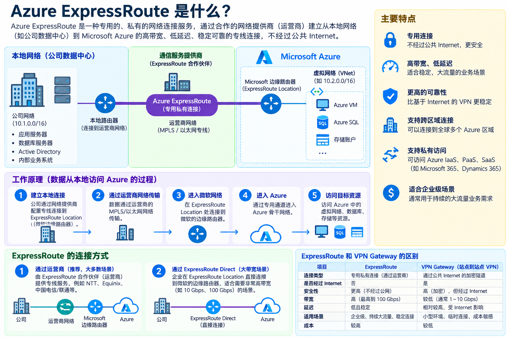

   - Azure ExpressRoute Global Reach: ⭐ **Connects separate on-premises datacenters through ExpressRoute/the Microsoft network.**
   - **Azure Virtual WAN:**
     - **Azure Virtual WAN has two SKU (Stock Keeping Unit) types: Basic and Standard.**
       - **Basic Virtual WAN can be used only for Site-to-Site VPN.**
       - **Upgrade to Standard to include ExpressRoute circuits.**
     - Centrally manages internet VPN connections using Azure VPN Gateway and private connections using Azure ExpressRoute, using regionally deployed routers called “virtual hubs.”

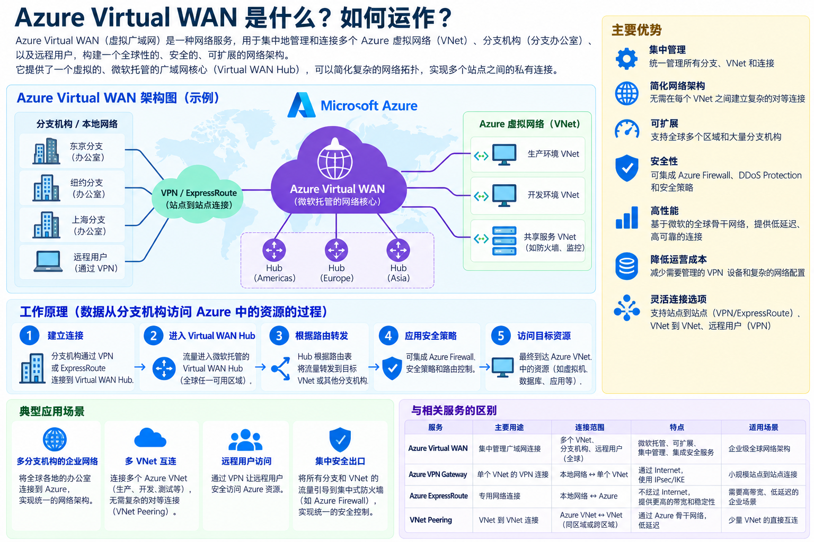

   - Secured hub: Optional features for an Azure Virtual WAN virtual hub include Azure Firewall, network virtual appliances, and SaaS solutions.
4. Azure Private Link

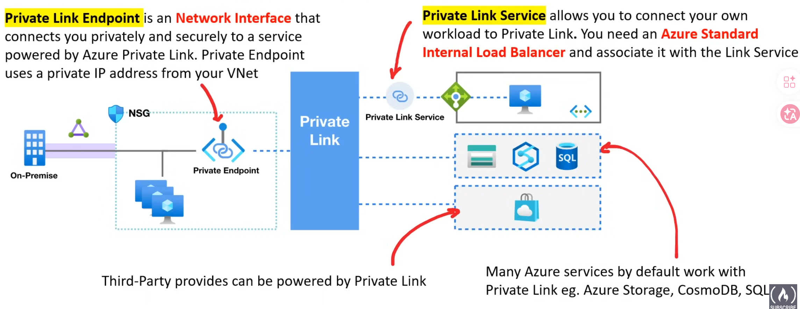

   - Azure Monitor Private Link Scope:

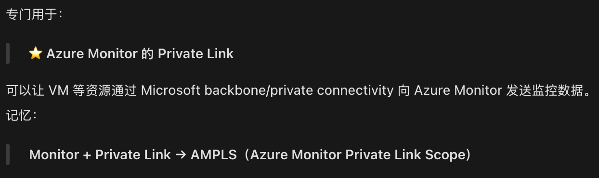

5. Optimize network performance
   - Accelerated Networking (AccelNet): Uses a technology called Single Root I/O Virtualization (SR-IOV) to significantly improve network performance.
   - Receive Side Scaling (RSS): Distributes processing across multiple CPU cores.
   - Proximity Placement Group: ⭐ **Places resources as close together physically as possible.**
6. Optimize network security
   - Azure DDoS Protection: “Public IP address-level” and “virtual network-level” protection.
   - Azure Web Application Firewall: Azure WAF is a **feature**, not a “service.” Examples of services where Azure WAF can be enabled:
     - Azure Application Gateway.
     - Azure Front Door.
     - Azure Content Delivery Network (CDN): Caches content (speeds up static resources).
       - Azure CDN stores content close to end users.
       - Azure Cache for Redis stores content close to the application.

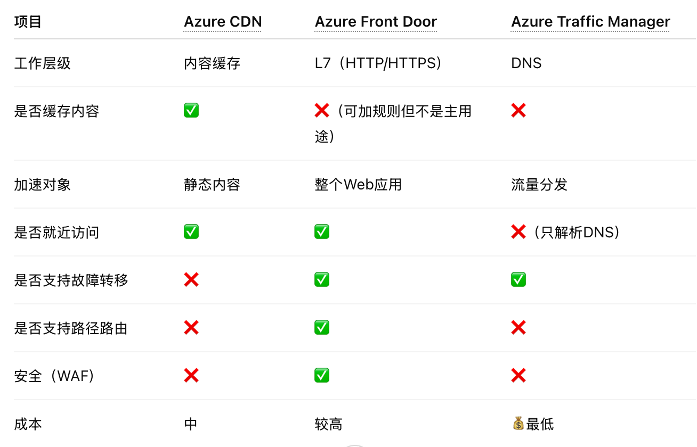

   - **Network Security Group: Allows or denies traffic based on source and destination IP addresses, port numbers, and protocol types.**
   - **Azure Firewall: The Azure Firewall policy must be in the same region.**
   - Azure Firewall Manager: Deploys and centrally manages Azure Firewall instances across multiple regions and subscriptions.
